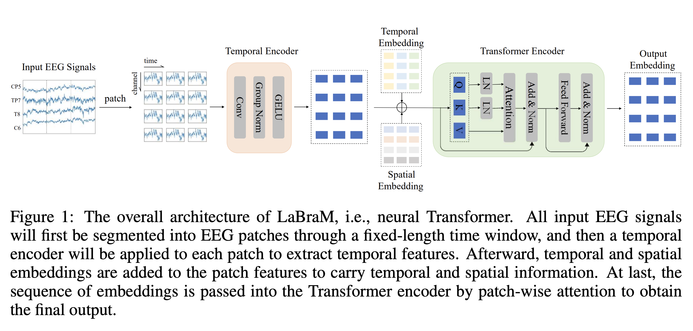
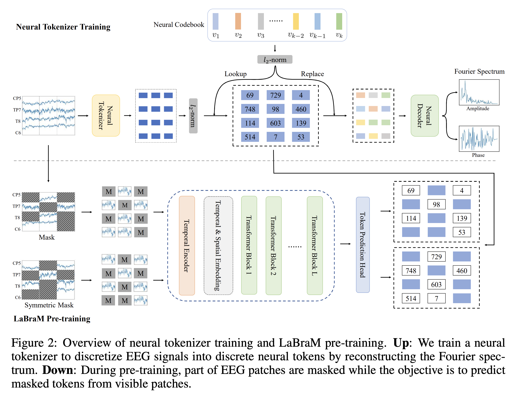

**NeuroStorm** is a Large Brain Model (LaBraM, or LBM), inspired by the architecture of Large Language Models (LLM).
This project focuses on detecting and classifying seizures from EEG brain signal recordings. This project aims to assist neurologists by automating the detection of anomalous neural activity, therby reducing manual workload and accelerating diagnosis.

## Why "NeuroStorm"?
Seizures are often described as electrical storms in the brain. NeuroStorm reflects this analogy.

## How It Works
- **Tokenizer** – NeuroStorm uses a **Vector Quantized Variational Autoencoder (VQ-VAE)** to tokenize EEG signals. The VAE processes **Fourier Transform spectra** of EEG signal patches, creating compact representations of brain activity.
- **Transformer Model** – The generated tokens are used to train a **transformer**, modeled after LLMs in natural language processing, but adapted to handle the Fourier spectra of EEG patches.
- **Classifier** – The transformer's output is passed to a neural network classifier, which identifies the type of seizure, if present.

The architecture is illustrated below, as described in the foundational paper 'Large Brain Model for Learning Generic Representations with Tremendous EEG Data in BCI'.

  
  
*Figures reproduced from: Jiang, Zhao, and Lu. "Large Brain Model for Learning Generic Representations with Tremendous EEG Data in BCI." arXiv, 2024. [arXiv:QzTpTRVtrP](https://openreview.net/pdf?id=QzTpTRVtrP)*  

## Project Foundation
This project replicates and extends the work presented in the 2024 ICLR conference paper **"Large Brain Model for Learning Generic Representations with Tremendous EEG Data in BCI"** by Wei-Bang Jiang, Li-Ming Zhao, and Bao-Liang Lu at Shanghai Jiao Tong University and Shanghai Emotionhelper Technology Co., Ltd.

Read the paper here https://openreview.net/pdf?id=QzTpTRVtrP

NeuroStorm adapts this work specifically for seizure detection, building on their groundbreaking research in Brain-Computer Interfaces (BCI).
